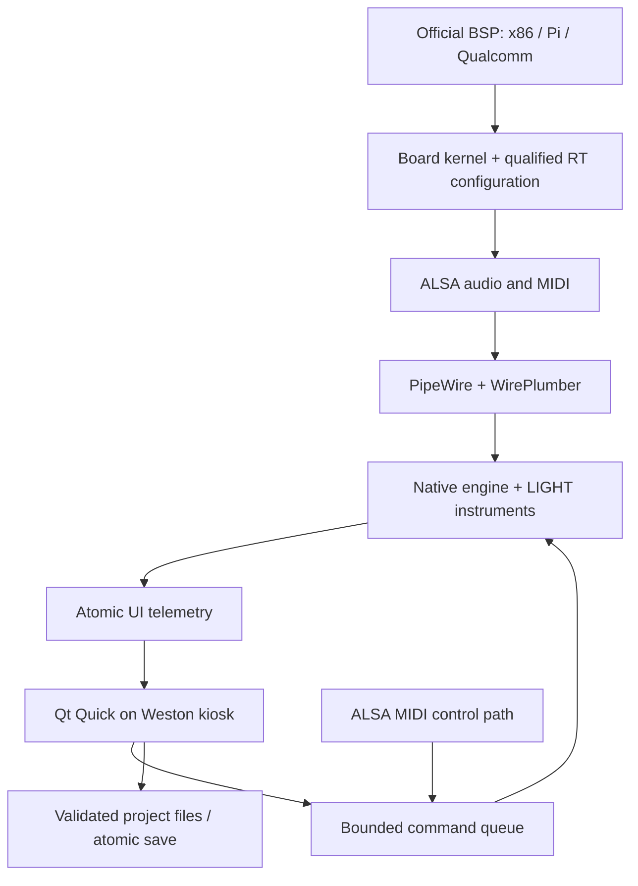

# Music OS implementation plan

Decision record: 2026-09-22. User direction: **Yocto from day one**, open-source
developer product; x86-64 hardware testing first, ARM64 a first-class architecture,
Pi boards and future Qualcomm systems, Arduino as a controller ecosystem. Reuse
LIGHT. No browser app. New code and owned LIGHT source use MIT by explicit choice.

## Recommended stack

| Layer | Choice | Why / boundaries |
|---|---|---|
| Distribution | Yocto/OpenEmbedded, custom ECO distro | Explicit image contents and per-board BSP selection. No desktop distro stage. |
| Reproducibility | kas 4.8, exact layer commit IDs | Reviewed dependency updates; source provenance and license checksums. Root ECO source is the local checkout and must also be committed/tagged for a release. |
| Current baseline | Scarthgap LTS + open-source Qt 6.8.3 layer | Verified compatible BSP/Qt layers and fetchable commits. Upgrade as one tested layer set; not a mixture of release branches. |
| Hardware | Official machine/BSP tunes | x86-64, AArch64, separate ARMv7 test path. No global NEON/AVX flags. |
| Kernel | BSP kernel for bring-up; qualified PREEMPT_RT per board | QEMU RT overlay supplied. Physical-board RT selection/patches require work; RT is a release gate, not an unverified label. |
| Init | systemd | Supervised services, per-process limits, diagnostics and restart behavior. |
| Display | Weston kiosk / Wayland + Qt Quick | Native touch-capable interface, C++ integration; no desktop shell. |
| Audio | PipeWire + WirePlumber + ALSA | Native PipeWire stream; JACK, ALSA and Pulse compatibility packages. One owned audio session. |
| DSP | LIGHT C11 instruments + C++20 host | Preserve useful synthesis; bounded commands; audio-thread ownership. Rust ownership-boundary experiment before any migration; see RUST-DECISION.md. |
| SIMD | LIGHT AArch64 NEON + scalar reference | Source-portable fallback on x86/ARMv7. Add optional AVX2 or ARMv7 NEON only behind equivalence tests and CPU dispatch. |
| MIDI | ALSA sequencer | USB controller input; current polling/capture is coarse and needs a timestamped event path. |
| Projects | Versioned JSON + Qt QSaveFile | Strictly validated, atomically replaced local file. No database in the callback. |
| Plugins | CLAP first; LV2 then VST3 | Implement later behind process isolation; each binary must match host ISA/ABI. |
| Updates | RAUC A/B after hardware/image acceptance | Not implemented in this developer image. Needs board bootloader integration and a persistent data layout. |

## Architecture

`meta-eco-core` contains only reusable distro/application/audio policy.
`meta-eco-bsp` contains ECO's board/kernel additions; machine BSP layers own
bootloaders, device trees, firmware and tuning. kas composes those layers.
This is the proposed `meta-musician-core` / `meta-musician-bsp` separation under
this repository's ECO naming.

## Corrections to the source notes

- PREEMPT_RT reduces scheduler latency. Firmware stalls, IRQs, USB scheduling,
  power management and drivers still affect deadlines. A kernel option alone
  does not establish hard real-time guarantees.
- The variable is `TUNE_FEATURES`, not `TUNED_FEATURES`. Do not append `neon` to
  `TARGET_FPU`. Use an official CPU tune; Cortex-M/AVR are not Linux targets.
- ARMv7 hard-float is a sensible ABI choice on compatible hardware, not a
  mathematical requirement for real-time DSP. NEON/VFP variants must match the
  actual CPU. AArch64 and 32-bit ARM need separate binaries and BSPs.
- Crypto extensions accelerate relevant crypto code, not arbitrary audio DSP.
  An NPU has no MVP role in the audio callback.
- `64/48000 = 1.333 ms` is one audio quantum, not round-trip latency. Start at
  256 frames, qualify 128, then 64. Measure the interface with physical loopback.
- Do not universally override `virtual/kernel` with `linux-yocto-rt`. Vendor
  kernels/BSPs may require a different RT patch set and board configuration.
- PipeWire's Pulse compatibility server does not require shipping a second
  standalone PulseAudio daemon. The image starts one owned PipeWire session.
- Architecture-neutral source does not mean any ARM device boots the same image.
  Require a specific machine, device tree/firmware set and tested audio interface.

## LIGHT reuse

Integrated now: FM6, TB-303 synthesis, drum DSP and ARM64 mixer. They sit behind a
new command-driven host; macOS CoreMIDI, Mach-O-only assumptions, global noise
state and the upstream callback mutex are not inherited into the Linux host.

The original 8×8 sample launcher, waveform loader, raylib instrument panels,
full parameter persistence and `.light` session model are valuable next ports.
The current 6×4 MIDI-step workstation is a smaller first native integration,
not a feature-complete replacement for LIGHT. See LIGHT-INTEGRATION.md.

## Milestones and release gates

| Stage | Deliverable | Exit test |
|---|---|---|
| M0: source foundation (this change) | Layers, pinned manifests, native host, integrated/tested LIGHT DSP, controller source | Core sanitizer/scalar/NEON tests; kas metadata validation. Full native build remains pending. |
| M1: first x86 developer image | Build on Linux, boot removable media, fullscreen UI, USB audio + MIDI, save/reload | No manual desktop launch; audio and MIDI ports work; saved project survives restart/power cycle. |
| M2: ARM64 parity | Pi 4/5 image and identical project/audio semantics; ARM64 CI | Hardware boot, display, USB, storage, MIDI and deterministic DSP tests on an actual Pi. |
| M3: real-time qualification | Board-specific RT kernel, preallocated graph, timestamped MIDI, measured xruns | 60-minute stress/recorded latency run at 48 kHz/128 frames; 64-frame mode offered only on passing combinations. |
| M4: preserve LIGHT workflow | Audio clips/samples, 8×8 view, FM/TB/drum editors, portable `.light` importer | Golden sessions, missing-asset recovery, sample-rate correctness, zero callback locks/allocations. |
| M5: developer plugin SDK | One native CLAP synth; LV2/VST3 later | Scan/crash isolation; killed worker cannot terminate transport; saved state reloads. |
| M6: release appliance | Signed A/B updates, persistent projects, recovery environment | Power-cut update tests, automatic rollback, user data preserved and compatibility matrix published. |

Qualcomm X/X2, i.MX and Rockchip get dedicated bring-up tracks after an exact
board is selected. The current experimental Qualcomm manifest targets only
boards named in the pinned `qcom-armv8a` BSP; it does **not** certify Snapdragon
X/X2 or ASUS QN10. A full Wrynose migration needs mutually compatible core,
Qt, Pi and Qualcomm revisions before it replaces this baseline.

## Immediate developer backlog

1. Build the x86 image and Qt host on Linux; fix parse/package/build issues from
   actual BitBake output. Record the full manifest and artifact checksums.
2. Test the user's x86 machine with a class-compliant USB interface. Gather boot
   logs, `pw-dump`, `pw-top`, ALSA/MIDI listings and exact hardware identifiers.
3. Port MIDI to timestamped sample-offset events; current 33 ms UI polling is
   adequate only for a functional demonstration. Preserve note duration and
   polyphony in the project model.
4. Split DSP into event-aligned blocks and cache coefficients. Current per-sample
   LIGHT wrappers prioritize correctness; benchmark before low-buffer claims.
5. Add project model serialization tests on Linux and then `.light` import with
   relative assets. Add sample ownership/reclamation without callback frees.
6. Integrate plugins only after audio continuity, RT behavior and persistence pass.

## Research basis

Primary sources reviewed during implementation:

- [Yocto custom distributions](https://docs.yoctoproject.org/dev-manual/custom-distribution.html): own distro layer and configuration.
- [Yocto release policy](https://www.yoctoproject.org/development/releases/): Scarthgap LTS support; migration planning.
- [Yocto tuning variables](https://docs.yoctoproject.org/ref-manual/variables.html#term-TUNE_FEATURES): machine/ABI-specific tuning.
- [Kernel RT theory](https://docs.kernel.org/core-api/real-time/theory.html) and [hardware limits](https://docs.kernel.org/core-api/real-time/hardware.html): scheduling improvement and hardware qualification.
- [PipeWire configuration](https://docs.pipewire.org/page_man_pipewire-jack_conf_5.html): latency requests and graph settings.
- [Qt Quick](https://doc.qt.io/qt-6/qtquick-index.html) and [meta-qt6](https://doc.qt.io/Boot2Qt-6.8/b2qt-meta-qt6.html): native interface and Yocto integration. Use open-source Qt modules; do not silently select commercial LTS builds.
- [Weston](https://wayland.pages.freedesktop.org/weston/): minimal compositor and kiosk operation.
- [meta-raspberrypi](https://github.com/agherzan/meta-raspberrypi/tree/scarthgap) and [meta-qcom](https://github.com/qualcomm-linux/meta-qcom/tree/scarthgap): actual layer/machine coverage.
- [LIGHT](https://github.com/deastrobooking/LIGHT/tree/15f08cae2ea297c8906ffc2cd37bf5e4aa62c693): source inspected locally; README/AGENT inconsistencies resolved by reading implementation.
- [CLAP](https://github.com/free-audio/clap), [LV2](https://lv2plug.in/), [VST3 SDK](https://github.com/steinbergmedia/vst3sdk): native plugin roadmap. Not currently hosted.
- [RAUC](https://rauc.readthedocs.io/en/latest/basic.html): future signed update/slot integration.
- [Arduino MIDIUSB](https://github.com/arduino-libraries/MIDIUSB): native USB MIDI controller firmware.

Language migration assessment: [RUST-DECISION.md](RUST-DECISION.md).
