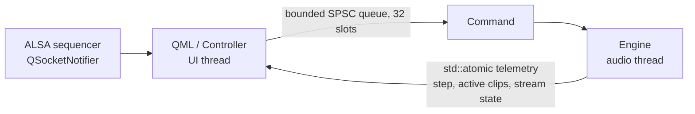
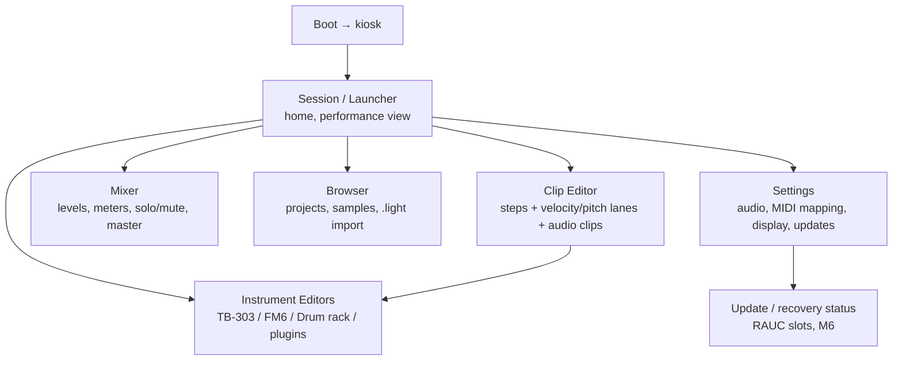

# ECO UI master document

Status: planning baseline, 2026-09-22. This is the single source of truth for
what the user interface is today, what it must become, and the order of work.
Feature work lands in later passes; this pass is documentation only. Cross-links:
[PLAN.md](PLAN.md) (milestones), [LIGHT-INTEGRATION.md](LIGHT-INTEGRATION.md)
(what the original UI offered), [HARDWARE.md](HARDWARE.md) (acceptance gates).

## 1. What the GUI is today

One fullscreen Qt Quick application ([native/Main.qml](../native/Main.qml),
~150 lines, single file) driven by one C++ context object
([native/src/controller.hpp](../native/src/controller.hpp), `Controller`,
exposed as `workstation`). Weston kiosk / Wayland is the compositor; there is
no desktop shell. Qt Quick style is forced to `Basic` in
[native/src/main.cpp](../native/src/main.cpp), so the visual identity is fully
owned by our QML, not a platform theme.

Current screens (all in one window, one ColumnLayout):

| Region | Contents | Notes |
|---|---|---|
| Header | Logo "e", title, "DEVELOPER PREVIEW 0.1", Reload/Save buttons | Save/reload target one hard-coded `session.eco.json` path. |
| Transport | Play toggle, Stop, Capture-MIDI arm, tempo SpinBox (40–240), step position readout | Two stop paths (toggle + stop) are redundant. "4:4 / 1 BAR QUANTIZE" is a static label, not a control. No time-signature model exists. |
| Session grid | 7×4 grid: 6 colored tracks + a "SCENES" column, clip launch buttons | Launches are bar-quantized by the engine. 4 scenes is an engine constant (`Scenes = 4`), not a UI limit. |
| Mixer strip | Per-track mute button, volume % label, slider (0–1) | Engine `Track` has `solo` and `Project` has `master`; neither is exposed in the UI. No level meters. |
| Clip editor | Selected track/scene label, Audition button, 16 step toggles | Steps are binary on/off. No velocity, pitch, length, or micro-timing editing. Project model stores one `{pitch, velocity}` per step; duration/polyphony are not representable (see [PLAN.md](PLAN.md) backlog item 3). |
| Status bar | Free-text message, PipeWire state line, shortcut hints | Messages are single-string, no severity or history. |

Input today: mouse/touch on controls, plus keyboard shortcuts Space (play),
Escape (leave fullscreen), Ctrl+S (save). MIDI input exists but is hard-mapped
([controller.hpp](../native/src/controller.hpp) `pollMidi`): any note-on
auditions the selected track, CC 20–23 launch scenes, CC 24 toggles play,
CC 7 sets selected-track volume. There is no mapping UI.

Threading contract (already correct, must stay correct):

- UI → audio: only `eco::Command` values through `Engine::commands`. A full
  queue surfaces "Command queue busy; try again." — acceptable for MVP, but
  the UI must treat send failure as first-class (see §4).
- Audio → UI: only lock-free atomics (`currentStep`, `activeClips`,
  `Audio::state`). A 33 ms `QTimer` re-polls these for repaint. MIDI capture
  is event-driven via `QSocketNotifier` on the sequencer fd, not the timer.
- The QML never sees a pointer to engine or instrument state. Any future view
  that "just reads" DSP or project data directly breaks this contract.

Honest gaps in the current UI (development-preview quality, by design):

1. No instrument editors. FM6 (6 operators), TB-303 (cutoff/resonance/
   accent/slide), and the drum rack (6 sound types, 16 pads upstream) are
   reachable only through fixed presets and one audition pitch each.
2. No audio clips, samples, waveforms, recording, or file browser. Engine is
   synthesis-only; playback of recorded audio is unplanned at model level.
3. Clip editing is step on/off only. No per-step velocity/pitch lanes, no
   note length, no polyphony, no pattern length other than 16.
4. No mixer view: no master fader, no solo, no pan, no meters, no sends.
5. No project/file management: one implicit session, no new/open/duplicate,
   no autosave indicator, no recovery dialog.
6. No settings surface: audio device, buffer size, MIDI routing and mapping
   are all compile-time or first-device defaults.
7. No undo/redo. Every edit is immediate and destructive.
8. Single-file QML: palette, metrics, and control look are inline literals;
   no reusable components, no testable view model boundary.
9. No accessibility or localization work: fixed pixel sizes, English strings
   inline, no focus order, no contrast audit, no screen-reader metadata.
10. UI development is coupled to Linux: `Controller` unconditionally includes
    ALSA/PipeWire headers, so the QML cannot be iterated on the macOS dev
    host that currently runs the DSP tests.

## 2. Product direction

ECO is a **baremetal music appliance**, not a desktop DAW window. The UI rules
follow from that:

- **Performance-first home screen.** The session grid is the instrument.
  Boot lands on the launcher, everything is reachable in ≤2 taps, and nothing
  modal can strand the user mid-performance.
- **Touch-first, controller-equal.** Minimum 44 px targets, no hover-only
  affordances, no right-click-only actions. Every UI action must be mappable
  to MIDI (note or CC) so the Arduino/LIGHT controller ecosystem is a peer,
  not an accessory. Keyboard remains for development.
- **Glanceable under stage conditions.** High-contrast palette (the existing
  moss-green/earth set is the identity), large transport readout, state
  visible from 2 m: playing/armed, tempo, position, audio health.
- **One owned audio session, surfaced honestly.** PipeWire state, xruns, and
  measured latency are shown as first-class status, not hidden. A silent
  failure is a product defect.
- **Non-destructive by default.** Autosave with visible state, undo for
  edits, atomic project files (already: `QSaveFile` + validated JSON).
- **No direct RT access, ever.** UI richness grows through new command types
  and new atomic/snapshot telemetry only (the same discipline
  [LIGHT-INTEGRATION.md](LIGHT-INTEGRATION.md) §Next-reuse item 4 mandates).

Screen map (target, not current):

Navigation is a shallow stack over the launcher: one level down, one gesture
back. No floating windows, no menu bar, no draggable panels.

## 3. UI improvement plan

Ordered to match the milestone gates in [PLAN.md](PLAN.md). Each item names
its dependency so UI work is never scheduled ahead of the engine capability
it visualizes.

### U1 — Foundation hardening (targets M1, before first hardware boot)

1. **Split the view model from platform services.** Extract an
   `IPlatformAudio` / `IPlatformMidi` interface behind `Controller`, with a
   null/mock implementation for off-target builds. Unlocks QML iteration and
   UI tests on the macOS/Linux dev host without PipeWire/ALSA. Pure refactor;
   no behavior change.
2. **Componentize the QML.** Break `Main.qml` into `Theme.qml` (singleton:
   the existing color array, spacing, font scale), `TransportBar`,
   `ClipGrid`, `MixerStrip`, `StepSequencer`, `StatusBar`. Behavior
   identical; enables independent testing and restyling.
3. **Transport cleanup.** Remove the duplicate Stop; make Play/Stop one
   control; expose `Project.master` as a master fader; expose `Track.solo`
   (engine already models it).
4. **Command-failure UX.** Queue-full and audio-unavailable states get
   visible, rate-limited status treatments instead of silently overwriting
   `message_`.
5. **Telemetry v1.** Add engine peak-level atomics per track and master;
   render simple meters in the mixer strip. Add an xrun counter surfaced in
   the status bar. (Engine change, small, control-thread owned.)

### U2 — Touch and kiosk quality (targets M2, ARM64 parity)

6. **Touch audit.** All interactive elements ≥ 44 px; grid cells grow to fill
   portrait/landscape; verify on Pi KMS/Weston at 800×480 and 1920×1080.
7. **Theme scale factors.** `Theme` gains a density property (compact /
   default / stage) so one UI serves desktop dev, Pi touchscreens, and TV-
   distance checking.
8. **First-run and empty states.** What the user sees on first boot, on
   audio-device failure, on missing/corrupt project (validation already
   rejects bad files; the UI must explain it).

### U3 — Clip editor v2 (targets M3–M4, needs model work first)

9. **Velocity lane + per-step pitch** under the step row; depends on project
   model v2 (note duration/polyphony — [PLAN.md](PLAN.md) backlog 3).
10. **Sub-step playhead.** Show position within the bar using engine frame
    telemetry, not just the 16-step index; depends on the PipeWire stream
    frame-position exposure noted in [controller.hpp](../native/src/controller.hpp).
11. **Pattern length and time signature** become real controls, replacing the
    static "4:4" label; engine constants become per-project values.

### U4 — Instrument editors and audio clips (targets M4, LIGHT workflow port)

12. **TB-303 editor:** cutoff, resonance, envelope mod, decay, accent, slide;
    per-step accent/slide flags in the clip editor. This is the highest-value
    LIGHT port — the 303 is unplayable without it.
13. **FM6 editor:** operator envelope/ratio/level grid for the two FM voices;
    preset load/save into the project.
14. **Drum rack:** 16-pad view, per-pad sound type, tuning, sample assignment.
15. **Audio clips:** waveform display from worker-thread-decoded immutable
    buffers (ownership/reclamation rule per
    [LIGHT-INTEGRATION.md](LIGHT-INTEGRATION.md) item 2); record/arm UI only
    after capture exists in the engine.
16. **8×8 launcher option** reproducing the original LIGHT grid workflow for
    controller parity, alongside the current 6×4 view.

### U5 — Browser, projects, undo (targets M4–M5)

17. **Project browser:** new/open/duplicate/rename, autosave indicator,
    last-session restore prompt. Storage layout must anticipate the M6
    persistent-data partition, not the current app-data path.
18. **Sample browser** with audition; `.light` import wizard reporting
    missing assets (importer spec: LIGHT-INTEGRATION item 3).
19. **Undo/redo** for clip edits and mixer moves (command pattern on the UI
    side; audio thread unaffected).

### U6 — Plugins and system surfaces (targets M5–M6)

20. **Plugin rack:** CLAP instrument/effect slots per track, generic
    parameter page from the CLAP params extension, crash-isolation status
    ("plugin recovered, audio unaffected") per the M5 isolation gate.
21. **Settings → Audio:** device, sample rate, buffer size with measured
    round-trip latency from the M3 loopback rig; only offer 64-frame mode on
    combinations that passed qualification ([HARDWARE.md](HARDWARE.md)).
22. **Settings → MIDI:** mapping editor, controller discovery, per-controller
    profiles (Arduino firmware CC layout is ours to define — see
    [firmware/](../firmware/README.md)).
23. **Settings → System:** RAUC slot/update status and recovery notices (M6
    only); diagnostic bundle export (boot logs, `pw-dump`, versions) matching
    what [HARDWARE.md](HARDWARE.md) asks testers to collect.

### Cross-cutting (continuous)

- **Accessibility:** logical focus order, keyboard-operable everything,
  minimum contrast 4.5:1 for text, no information carried by color alone
  (track colors always paired with names/icons).
- **Localization:** all strings through `qsTr()` as components are written;
  do not retrofit 150 inline strings later.
- **Performance budget:** UI thread ≤ 16 ms frames on Pi 4; no per-frame
  allocations in delegates; telemetry polling stays on the 33 ms timer unless
  a measured need exists.
- **Testing:** Qt Quick Test or Squish-style UI smoke tests run against the
  mock platform (U1.1); golden-screenshot checks in CI once an offscreen
  QML render path exists. UI tests join [VALIDATION.md](VALIDATION.md) only
  when actually executed.

## 4. DAW feature-set needs (UI-visible backlog, engine-tracked)

Features the UI must eventually expose, in dependency order. This list is the
UI-facing mirror of the PLAN milestones; nothing here starts before its
engine/model dependency lands.

| # | Feature | Engine/model dependency | Milestone |
|---|---|---|---|
| F1 | Master fader, solo, meters, xrun display | Peak/xrun atomics (U1.5) | M1 |
| F2 | Timestamped MIDI capture into clips | ALSA→frameOffset conversion (PLAN backlog 3) | M3 |
| F3 | Note duration, polyphony, per-step pitch/velocity | Project model v2, `.eco.json` schema bump with migration | M3–M4 |
| F4 | Pattern length ≠ 16, time signatures | Engine step model generalization | M4 |
| F5 | TB-303 accent/slide; FM6 + drum parameters | Per-instrument parameter commands + project fields | M4 |
| F6 | Audio clips, recording, waveform views | Capture path, sample ownership, deferred reclamation | M4 |
| F7 | `.light` session import | Validated importer, relative assets | M4 |
| F8 | 8×8 grid + controller parity | Scene/clip model generalization beyond 6×4 | M4 |
| F9 | Arrangement view (scene sequence → song) | Arrangement model, or explicit decision to stay clip-based | M5 (decision needed) |
| F10 | CLAP plugin hosting UI | Process isolation, state persistence (PLAN M5) | M5 |
| F11 | Undo/redo | UI-side command history (U5.19) | M5 |
| F12 | Automation (tempo, mixer, instrument params) | Sample-accurate parameter ramps in engine | M5–M6 |
| F13 | Update/recovery UI, persistent projects | RAUC slots, data partition (PLAN M6) | M6 |

Open product decisions to resolve before U4–U6 scheduling:

1. **Clip-launcher vs. linear arranger identity.** LIGHT heritage and the
   current grid say launcher-first; a minimal scene-sequence arrangement
   (F9) may be enough. Decide before building browser/undo around one model.
2. **Track count growth.** Engine constants (`Tracks = 6, Scenes = 4`) are
   compile-time. F8 implies 8×8; decide whether track/scene counts become
   per-project (model v2) or stay fixed with paging.
3. **Recording scope.** Playback of imported samples (F6 first half) is far
   cheaper than live capture (needs input latency qualification, monitoring
   path, gain staging UI). Confirm capture is in the product, not just
   playback.
4. **Controller layout authority.** The UI's MIDI mapping editor (U6.22) and
   the Arduino firmware should share one published CC/note map; decide
   whether the firmware or the OS doc owns the canonical table.

## 5. Invariants for every future UI change

1. UI touches audio only through `Engine::commands`; engine touches UI only
   through atomics. New telemetry needs a new atomic/snapshot, never a
   pointer or a lock.
2. Every user action is reachable by touch, keyboard, and MIDI.
3. Every destructive action is undoable or confirmed; every project write is
   atomic and validated on load.
4. Every new screen states its dependency (engine feature, milestone) in this
   document before implementation.
5. UI claims in README/VALIDATION distinguish "QML written" from "run on
   target hardware" — the same evidence discipline the rest of the repo uses.
